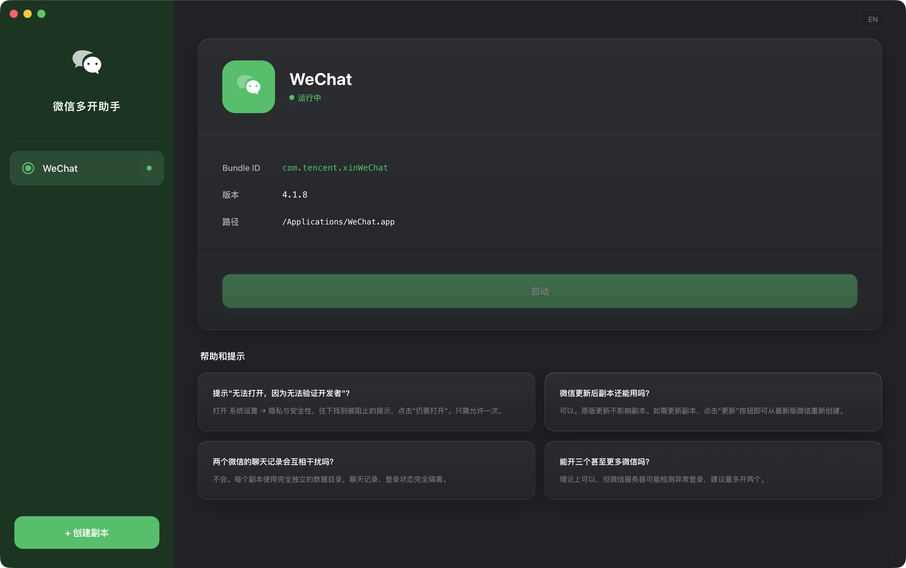
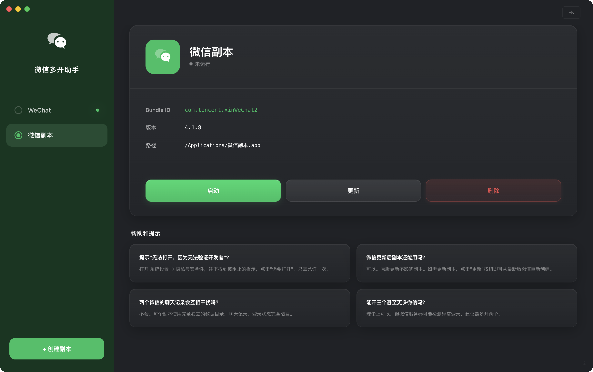
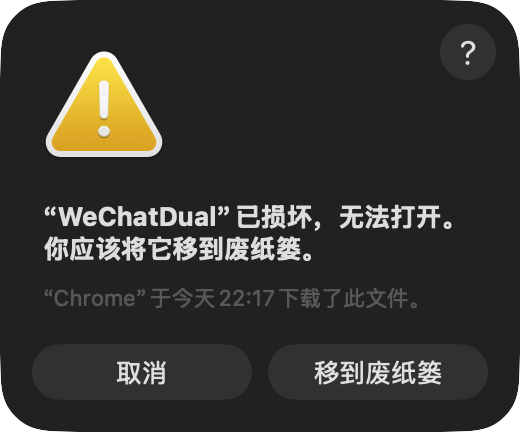

<div align="center">


# WeChat Dual Launcher

**在 macOS 上同时运行两个微信实例 / Run two WeChat instances simultaneously on macOS**

[](https://github.com/Gzbox/wechat-dual-launcher/releases)
[](./LICENSE)
[](https://github.com/Gzbox/wechat-dual-launcher)
[](https://www.electronjs.org/)
[](https://github.com/Gzbox/wechat-dual-launcher/pulls)

[English](#-overview) · [简体中文](#-简介) · [Download](https://github.com/Gzbox/wechat-dual-launcher/releases) · [Report Bug](https://github.com/Gzbox/wechat-dual-launcher/issues)

<br>




</div>

---

## 📖 Overview

**WeChat Dual Launcher** is a modern, fast, and secure macOS desktop application built to solve a common pain point: running multiple WeChat accounts at the same time. It creates an isolated copy of WeChat with a unique `Bundle ID`, letting macOS treat it as a completely separate application — no jailbreaking, no hacks, no modifications to your original WeChat.

### ✨ Key Features

| Feature                     | Description                                                                        |
| :-------------------------- | :--------------------------------------------------------------------------------- |
| **One-Click Dual Instance** | Create and launch a second WeChat instance in seconds.                             |
| **Automatic Detection**     | Automatically locates your WeChat installation — zero configuration needed.        |
| **Safe & Non-Destructive**  | Your primary `WeChat.app` is never modified. The clone is a separate copy.         |
| **Sync Updates**            | When WeChat updates, refresh your clone with one click to stay current.            |
| **Clean Uninstall**         | Completely removes the cloned app and its sandbox data when you no longer need it. |
| **Internationalization**    | Full English & Simplified Chinese UI with auto-detection.                          |
| **Auto Updater**            | Built-in update mechanism to keep the launcher itself up-to-date.                  |
| **CI/CD**                   | Automated builds and GitHub Releases via GitHub Actions.                           |

---

## 🔧 Requirements

| Requirement          | Details                                                         |
| :------------------- | :-------------------------------------------------------------- |
| **Operating System** | macOS 10.15 (Catalina) or later                                 |
| **WeChat**           | Official WeChat for Mac installed in `/Applications/WeChat.app` |
| **Architecture**     | Apple Silicon (M1/M2/M3/M4) and Intel (x86_64)                  |

---

## 🚀 Quick Start

### Download Pre-built Release

Head to the [**Releases**](https://github.com/Gzbox/wechat-dual-launcher/releases) page, download the latest `.dmg`, open it, and drag **WeChat Dual** into your Applications folder.

### Build from Source

> **Prerequisites**: [Node.js](https://nodejs.org/) >= 18 and npm >= 9.

```bash
# Clone the repository
git clone https://github.com/Gzbox/wechat-dual-launcher.git
cd wechat-dual-launcher

# Install dependencies
npm install

# Start in development mode (with hot-reload)
npm run dev

# Build production DMG for macOS
npm run build:mac
```

The compiled `.dmg` and `.zip` artifacts will be generated in the `dist/` directory.

---

## ❗ Troubleshooting / 常见问题

### 🚨 "WeChat Dual" is damaged and can't be opened / "已损坏，无法打开"

<div align="center">
  
</div>

<br>

> **This is expected behavior!** Since this app is not signed with an Apple Developer certificate, macOS Gatekeeper will block it. This does **NOT** mean the app is actually damaged — it is a standard macOS security warning for unsigned applications.
>
> **这是正常现象！** 由于本应用没有 Apple 开发者证书签名，macOS 的 Gatekeeper 会阻止打开。这**并不意味着**应用真的已损坏 —— 这只是 macOS 对未签名应用的标准安全提示。

#### ✅ Fix / 解决方法

Open **Terminal.app** and run the following command:

打开 **终端 (Terminal.app)**，运行以下命令：

```bash
sudo xattr -r -d com.apple.quarantine /Applications/WeChatDual.app
```

Then open the app again — it will launch normally. You only need to do this **once**.

然后重新打开应用即可正常使用。此操作**只需执行一次**。

> [!TIP]
> **What does this command do?** / **这条命令做了什么？**
>
> It removes the macOS quarantine flag that is automatically added to files downloaded from the internet. This is safe and only affects this specific app.
>
> 它移除了 macOS 自动为从互联网下载的文件添加的隔离标记。此操作是安全的，且仅影响这一个应用。

---

## 🏗️ Architecture

```
wechat-dual-launcher/
├── src/
│   ├── main/               # Electron Main Process
│   │   ├── index.ts         #   App lifecycle & IPC handler registration
│   │   ├── wechat.ts        #   Core logic: detect / create / launch / update / delete
│   │   └── updater.ts       #   Auto-update integration (electron-updater)
│   ├── preload/             # Context Bridge (secure IPC)
│   │   ├── index.ts         #   Exposes typed API to renderer
│   │   └── index.d.ts       #   Type declarations
│   └── renderer/            # Frontend (React 19)
│       └── src/
│           ├── components/  #   UI components (Dashboard, Dialogs, Modals)
│           ├── hooks/       #   Custom React hooks
│           ├── i18n/        #   Internationalization (en / zh)
│           └── App.tsx      #   Root component
├── build/                   # Build resources (icons, entitlements)
├── .github/workflows/       # CI/CD (GitHub Actions)
├── electron-builder.yml     # Packaging & distribution config
└── electron.vite.config.ts  # Vite bundler config
```

### Tech Stack

| Layer      | Technology                                                                       |
| :--------- | :------------------------------------------------------------------------------- |
| Framework  | [Electron 41](https://www.electronjs.org/)                                       |
| Frontend   | [React 19](https://react.dev/) + [TypeScript 5](https://www.typescriptlang.org/) |
| Styling    | [Tailwind CSS v4](https://tailwindcss.com/)                                      |
| Build Tool | [Electron Vite 5](https://electron-vite.org/)                                    |
| Packaging  | [electron-builder 26](https://www.electron.build/)                               |
| Linting    | [ESLint 9](https://eslint.org/) + [Prettier](https://prettier.io/)               |

### How It Works

```
┌──────────────────┐        IPC (invoke/handle)       ┌─────────────────────┐
│   Renderer       │ ──────────────────────────────▶  │   Main Process      │
│   (React UI)     │                                  │                     │
│                  │  ◀────────── events ────────────  │   wechat.ts         │
│   Dashboard      │       (progress, updater)        │    ├ detectWeChat()  │
│   ConfirmDialog  │                                  │    ├ createInstance()│
│   InfoModal      │                                  │    ├ launchInstance()│
│   UpdaterModal   │                                  │    ├ updateInstance()│
└──────────────────┘                                  │    └ deleteInstance()│
        ▲                                             └─────────┬───────────┘
        │                                                       │
   Context Bridge                                     macOS system calls
   (preload/index.ts)                                (cp, codesign, PlistBuddy)
```

1. **Detect** — Scans `/Applications` and `~/Applications` for `WeChat.app` by matching its `CFBundleIdentifier`.
2. **Clone** — Copies the `.app` bundle via `/bin/cp -R`, modifies `CFBundleIdentifier` and `CFBundleName` via `PlistBuddy`, then re-signs with `codesign`.
3. **Launch** — Spawns the cloned executable as a detached child process.
4. **Update** — Deletes the old clone (preserving container/chat data), re-copies from the latest original, and re-applies the custom bundle ID.
5. **Delete** — Removes the `.app` bundle and its sandbox containers.

---

## 📜 Available Scripts

| Command                 | Description                              |
| :---------------------- | :--------------------------------------- |
| `npm run dev`           | Start development server with hot-reload |
| `npm run build`         | Type-check and compile the project       |
| `npm run build:mac`     | Build production macOS DMG + ZIP         |
| `npm run build:win`     | Build production Windows installer       |
| `npm run build:linux`   | Build production Linux package           |
| `npm run lint`          | Run ESLint                               |
| `npm run format`        | Format code with Prettier                |
| `npm run typecheck`     | Run TypeScript type checking             |
| `npm run publish:mac`   | Build and publish to GitHub Releases     |
| `npm run release:patch` | Bump patch version and push tag          |
| `npm run release:minor` | Bump minor version and push tag          |
| `npm run release:major` | Bump major version and push tag          |

---

## 🔄 CI/CD

This project uses **GitHub Actions** for automated releases. Push a version tag to trigger the pipeline:

```bash
# Bump version & create git tag automatically
npm run release:patch    # 0.0.1 → 0.0.2

# Or manually
git tag v1.0.0
git push --tags
```

The [release workflow](.github/workflows/release.yml) will:

1. Run type checks
2. Build the Electron app with `electron-vite`
3. Package into `.dmg` and `.zip`
4. Publish to **GitHub Releases** automatically

---

## 🤝 Contributing

Contributions are welcome! Please feel free to submit a Pull Request.

1. **Fork** the repository
2. **Create** your feature branch (`git checkout -b feature/amazing-feature`)
3. **Commit** your changes (`git commit -m 'feat: add amazing feature'`)
4. **Push** to the branch (`git push origin feature/amazing-feature`)
5. **Open** a Pull Request

> Please follow [Conventional Commits](https://www.conventionalcommits.org/) for commit messages.

---

## 📄 License

This project is licensed under the **MIT License** — see the [LICENSE](./LICENSE) file for details.

---

## ⚠️ Disclaimer

This project is an independent, open-source tool for personal convenience. It is **not** affiliated with, endorsed by, or associated with Tencent or WeChat in any way. Use at your own discretion and responsibility.

---

<div align="center">

Made with ❤️ by [dingzhen](https://github.com/Gzbox)

If this project helped you, consider giving it a ⭐

</div>

---

<details>
<summary><strong>📖 简介（中文文档）</strong></summary>

<br>

## 📖 简介

**WeChat Dual Launcher（微信双开助手）** 是一款现代、快速、安全的 macOS 桌面应用，解决了一个常见痛点：**在同一台 Mac 上同时登录两个微信账号**。

它通过创建一份拥有独立 `Bundle ID` 的微信副本，让 macOS 将其识别为一个完全独立的应用程序 —— 无需越狱，无需黑科技，不修改原始微信。

### ✨ 核心功能

| 功能           | 说明                                     |
| :------------- | :--------------------------------------- |
| **一键双开**   | 几秒内即可创建并启动第二个微信实例       |
| **自动检测**   | 自动定位微信安装路径，零配置             |
| **安全无损**   | 不修改原始 `WeChat.app`，副本完全独立    |
| **一键同步**   | 微信更新后，一键刷新副本即可同步最新版本 |
| **彻底清理**   | 不需要时可完整移除副本及其沙盒数据       |
| **中英双语**   | 完整的中英文界面，自动检测系统语言       |
| **自动更新**   | 内置更新机制，保持启动器本身为最新版本   |
| **自动化发布** | 通过 GitHub Actions 自动构建和发布       |

### 🔧 环境要求

| 要求           | 详情                                                |
| :------------- | :-------------------------------------------------- |
| **操作系统**   | macOS 10.15 (Catalina) 或更高版本                   |
| **微信**       | 安装在 `/Applications/WeChat.app` 的官方 Mac 版微信 |
| **处理器架构** | Apple Silicon (M1/M2/M3/M4) 和 Intel (x86_64)       |

### 🚀 快速开始

前往 [**Releases**](https://github.com/Gzbox/wechat-dual-launcher/releases) 页面，下载最新的 `.dmg` 文件，打开后将 **WeChat Dual** 拖入 Applications 文件夹即可。

#### 从源码构建

```bash
# 克隆仓库
git clone https://github.com/Gzbox/wechat-dual-launcher.git
cd wechat-dual-launcher

# 安装依赖
npm install

# 启动开发模式（支持热重载）
npm run dev

# 构建生产版 macOS DMG
npm run build:mac
```

### ❗ 常见问题

#### 🚨 提示"已损坏，无法打开"

<div align="center">
  
</div>

<br>

> **这是正常现象！** 由于本应用没有 Apple 开发者证书签名，macOS 的 Gatekeeper 会阻止打开。这**不代表**应用真的已损坏。

打开 **终端 (Terminal.app)**，运行以下命令即可解决：

```bash
sudo xattr -r -d com.apple.quarantine /Applications/WeChatDual.app
```

然后重新打开应用即可正常使用。**只需执行一次。**

### 📄 许可协议

本项目基于 **MIT License** 开源 —— 详见 [LICENSE](./LICENSE)。

### ⚠️ 免责声明

本项目是独立的开源工具，仅供个人便利使用。**与腾讯或微信没有任何关联**，非官方产品。请自行承担使用风险。

</details>
